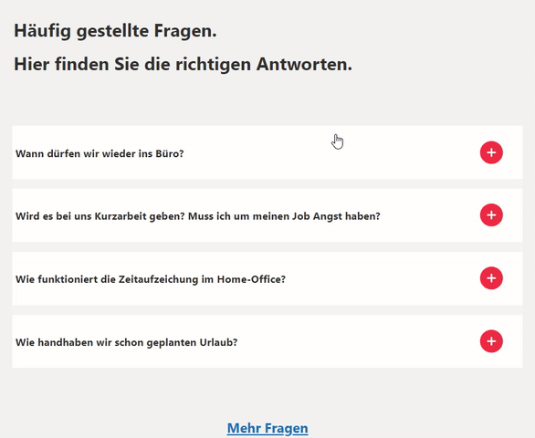

# Corona List SPFx Webpart

This project uses [React](https://reactjs.org).

This webpart should be used to display a FAQ, especially in hard times like these where you want to inform your staff over sharepoint.
More information about it [here](https://www.smarterbusiness.at/faq-informationsseite-zur-corona-krise-mittels-sharepoint-teams-erstellen)



## Global dependencies

Requires Gulp globally installed:

```shell
npm install --global gulp
```

## Building the code

Download & install all dependencies, build, bundle & package the project

```shell
# download & install dependencies
npm install

# transpile all TypeScript & SCSS => JavaScript & CSS
gulp build

# create component bundle & manifest
gulp bundle

# create SharePoint package
gulp package-solution
```

These commands produce the following:

- **./lib**: intermediate-stage commonjs build artifacts
- **./dist**: bundled script, along with other resources
- **./temp/deploy**: all resources required by component(s) to deploy to a CDN (when `--ship` argument present)

## Build options

- `gulp clean`: Deletes all build output (**/dist**, **/lib**, **/temp**, etc.).
- `gulp build`: Transpiles all TypeScript & SCSS to JavaScript & CSS, generates source map files & TypeScript type declaration files
- `gulp bundle [--ship|-p|--production]`: Runs gulp task **build**, then uses webpack to create the JavaScript bundle(s) and component manifest(s) as defined in **./config/config.json**. The `--ship`, `-p` or `--production` argument specifies a production build that will generate minified bundles.
- `gulp serve [--ship|-p|--production]`: Runs gulp tasks **build**, **bundle** & starts the local webserver. Depending on the project type, it opens the browser and navigates to the local workbench or specified URL (in the case of extension components). The `--ship`, `-p` or `--production` argument specifies a production build that modifies the resulting package for production hosting rather than local hosting of assets.
- `gulp package-solution`: Creates the SharePoint Package (**.sppkg**) file.
- `gulp dist`: Creates a production-ready SharePoint Package (**.sppkg**) file. The following gulp task gets executed in this specific order `gulp clean`, `gulp bundle`, `gulp package-solution.`
- `gulp dev`: Creates a development-ready SharePoint Package (**.sppkg**) file. The following gulp task will be executed in this specific order `gulp clean`, `gulp bundle`, `gulp package-solution.`

> View all available gulp tasks by running `gulp --tasks`

More information on [SharePoint Framework](https://docs.microsoft.com/en-us/sharepoint/dev/spfx/sharepoint-framework-overview)

Generated with [pnp/spfx](https://github.com/pnp/generator-spfx/).
=======
# Introduction 
TODO: Give a short introduction of your project. Let this section explain the objectives or the motivation behind this project. 

# Getting Started
TODO: Guide users through getting your code up and running on their own system. In this section you can talk about:
1.	Installation process
2.	Software dependencies
3.	Latest releases
4.	API references

# Build and Test
TODO: Describe and show how to build your code and run the tests. 

# Contribute
TODO: Explain how other users and developers can contribute to make your code better. 

If you want to learn more about creating good readme files then refer the following [guidelines](https://docs.microsoft.com/en-us/azure/devops/repos/git/create-a-readme?view=azure-devops). You can also seek inspiration from the below readme files:
- [ASP.NET Core](https://github.com/aspnet/Home)
- [Visual Studio Code](https://github.com/Microsoft/vscode)
- [Chakra Core](https://github.com/Microsoft/ChakraCore)
